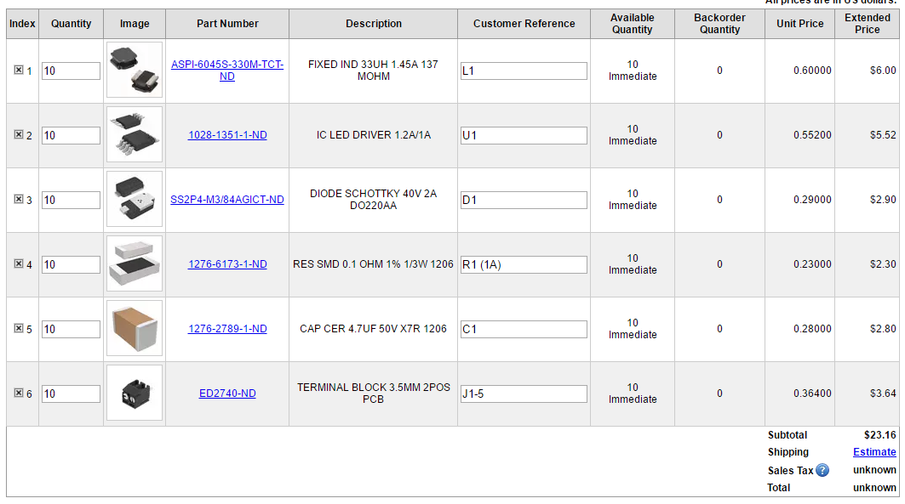

# Basic4

A 4 channel design based on the RichTek RT8471 controller, for up to 1A, in a tiny 1.7x2.2 inch form factor. Optional integrated controller based on a PIC16F to provide local PWM control from analog inputs or as an I2C slave device.

## DigiKey BOM

For the driver portion only:

Quantites will be sufficient to build two boards.

http://www.digikey.com/short/3jdmbq

